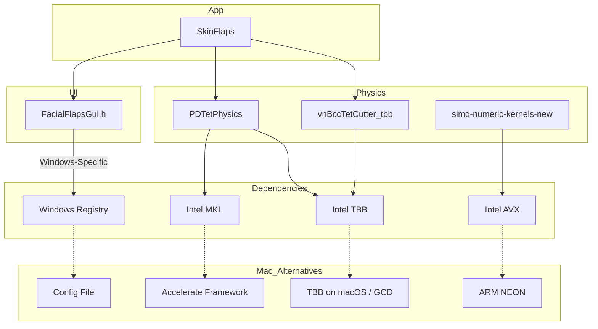

# Codebase Map and Dependency Graph

This document provides a high-level overview of the SkinFlaps codebase architecture and its platform-specific dependencies.

## Dependency Graph

The following diagram illustrates the major components of the application and their dependencies that are relevant to the macOS porting effort.

### Component Descriptions:

-   **SkinFlaps**: The main application executable.
-   **FacialFlapsGui.h**: Handles the GUI, user input, and currently contains Windows-specific code (Registry access).
-   **PDTetPhysics**: The core physics simulation library. It depends on a math kernel library (MKL) and a threading library (TBB).
-   **simd-numeric-kernels-new**: Contains low-level, performance-critical math kernels that are implemented using platform-specific SIMD instructions (AVX).
-   **vnBccTetCutter_tbb**: A class used for mesh processing, parallelized with TBB. 